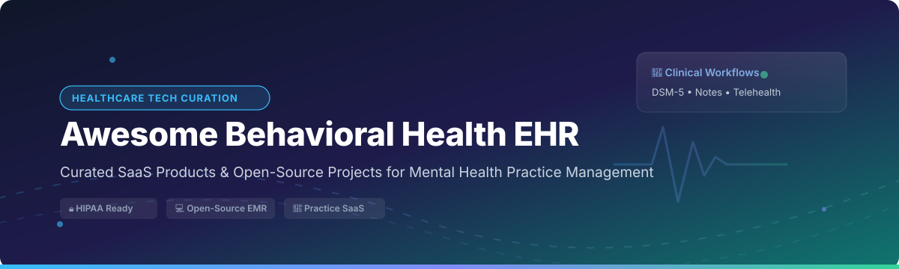

# 🧠 Awesome Behavioral Health EHR & Mental Health Practice Management Software 🏥

> **A comprehensive, curated directory of top Electronic Health Records (EHR), Electronic Medical Records (EMR), Practice Management Software, and Open-Source Solutions for Behavioral Health, Psychiatry, Psychotherapy, and Substance Use Disorder (SUD) Clinics.**

📅 **Last updated:** September 2026

---

## 📌 Table of Contents
- [📊 Market Overview & Industry Dynamics](#-market-overview--industry-dynamics)
- [🏢 SaaS & Cloud Practice Management Platforms](#-saas--cloud-practice-management-platforms)
- [💻 Open-Source EHR & EMR GitHub Projects](#-open-source-ehr--emr-github-projects)
- [🤝 How to Contribute](#-how-to-contribute)
- [💖 Support & Sponsorship](#-support--sponsorship)
- [⚖️ Disclaimer & Compliance](#%EF%B8%8F-disclaimer--compliance)
- [📈 Star History](#-star-history)

---

## 📊 Market Overview & Industry Dynamics

> **Market Size:** The global Behavioral Health EHR market is estimated at **$2.8 Billion - $3.2 Billion** and is projected to expand at a CAGR of **11.5% - 13.2%**, driven by rising demand for mental healthcare, teletherapy integration, and regulatory support for digital healthcare.
>
> **Market Structure:** The behavioral health EHR market is **moderately to highly fragmented**. Unlike general acute care EHRs (which are dominated by enterprise giants like Epic and Cerner), behavioral health features hundreds of specialized SaaS providers catering to solo therapists, group practices, residential addiction treatment facilities, and community health organizations. While consolidated enterprise entities (e.g., Qualifacts, NextGen, Tebra/Kareo) hold significant market share in enterprise behavioral health, solo and small practices remain heavily split across agile cloud-first tools like SimplePractice and TheraNest.

---

## 🏢 SaaS & Cloud Practice Management Platforms

The following platforms offer specialized clinical documentation, scheduling, billing, claims management, and telehealth designed specifically for psychiatrists, therapists, counselors, and mental health clinics. *Sorted by estimated company revenue/size (descending).*

| Platform 🌐 | Description 📝 | Company Size / Est. Annual Revenue 💰 | Starting Pricing 💵 | Free Trial / Tier Details 🎁 |
| :--- | :--- | :--- | :--- | :--- |
| **[NextGen Behavioral Health](https://www.nextgen.com/)** | Enterprise behavioral health EHR with integrated practice management, population health, and automated revenue cycle management. | **~$650M - $700M** (Public/Enterprise) | $300 / provider / month (Office edition base estimate) | No free trial; guided demo and discovery assessment available |
| **[Qualifacts](https://www.qualifacts.com/)** | Enterprise EHR solutions tailored specifically for behavioral health, human services, and CCBHCs (includes Credible & InSync brands). | **~$150M - $200M** (Private Equity Backed) | $50 / provider / month (Estimated starting base tier) | No free trial; custom consultation and guided demo available |
| **[AdvancedMD Behavioral Health](https://www.advancedmd.com/)** | Comprehensive medical & behavioral health EHR with integrated telehealth, patient portal, and medical billing workflows. | **~$100M - $150M** (Global Payments Subsidiary) | $130 / provider / month (AdvancedMD Now edition) | 30-day free trial (available for AdvancedMD Now edition) |
| **[Kareo Behavioral Health](https://www.kareo.com/)** | Clinical EHR and practice management platform (part of Tebra) specializing in therapy and psychiatric documentation. | **~$100M - $150M** (Part of Tebra Group) | $249 / provider / month (Low-volume mental health plan) | No free trial; personalized product demos available |
| **[SimplePractice](https://www.simplepractice.com/)** | Leading cloud practice management platform used by over 185,000 health, wellness, and psychotherapy professionals. | **~$80M - $100M** (EngageSmart Subsidiary) | $49 / month (Starter plan) | 30-day free trial (no credit card required, access to Plus plan features) |
| **[Valant](https://www.valant.com/)** | Behavioral health-specific EHR built for group therapy practices and psychiatric clinics with clinical outcome tracking. | **~$40M - $60M** (Private Equity Backed) | $100 / provider / month | No free trial; live and recorded demos available upon request |
| **[TheraNest](https://www.theranest.com/)** | Mental health practice management software with scheduling, client portal, DSM-5 notes, and telehealth for counselors. | **~$30M - $50M** (Part of Therapy Brands) | $29 / therapist / month | 21-day free trial (no credit card required) |
| **[InSync Healthcare](https://www.insynchcs.com/)** | Cloud behavioral health and human services EHR with custom clinical note forms and mobile practice tools. | **~$25M - $40M** (Qualifacts Subsidiary) | $50 / user / month (Base user tier) | No free trial; guided software demo available |
| **[ICANotes](https://www.icanotes.com/)** | Clinically intuitive behavioral health EHR renowned for narrative note-generation and psychiatric documentation speed. | **~$15M - $25M** (Private Company) | $35 / user / month (Part-time / admin tiers) | 30-day free trial (no credit card required) |
| **[Credible](https://credibleinc.com/)** | Enterprise behavioral health EHR for community mental health centers, addiction treatment facilities, and state agencies. | **~$15M - $25M** (Qualifacts Subsidiary) | $45,000 / year (Enterprise agency base estimate) | No free trial; personalized demo available |

---

## 💻 Open-Source EHR & EMR GitHub Projects

Open-source EHR systems empower clinics, researchers, solo practitioners, and software engineers to deploy self-hosted, vendor-independent medical and therapy record systems. *Sorted by GitHub Stars_Count (descending).*

| Project & Repository 🚀 | GitHub_Stars ⭐ | Primary Tech Stack 🛠️ | Description & Behavioral Health Fit 💡 | License 📜 |
| :--- | :--- | :--- | :--- | :--- |
| **[Odoo](https://github.com/odoo/odoo)** |  | Python, JavaScript, PostgreSQL | Modular enterprise ERP with community health modules, patient record management, appointment scheduling, and clinic accounting. | LGPL-3.0 |
| **[ERPNext Healthcare](https://github.com/frappe/erpnext)** |  | Python, Frappe Framework, Vue.js | Turnkey clinic ERP integrating patient encounters, therapy appointments, e-Prescriptions, and billing with core HR and accounting. | GPL-3.0 |
| **[HospitalRun](https://github.com/hospitalrun/hospitalrun-frontend)** |  | Ember.js, Node.js, CouchDB | User-friendly offline-first electronic health record platform designed for medical humanitarian efforts and rural outpatient clinics. | MIT |
| **[OpenMRS Core](https://github.com/openmrs/openmrs-core)** |  | Java, React (O3), MySQL | Enterprise-grade medical records system platform built around a flexible Concept Dictionary (CIEL) adaptable for psychiatric diagnosis. | MPL-2.0 |
| **[OpenEMR](https://github.com/openemr/openemr)** |  | PHP, JavaScript, MySQL | ONC-certified open-source EHR with 3,370+ stars. Features customizable clinical notes, intake forms, patient portal, and 2FA authentication. | GPL-3.0 |
| **[Medplum](https://github.com/medplum/medplum)** |  | TypeScript, React, Node.js, PostgreSQL | Headless, FHIR-native healthcare developer platform for building custom HIPAA-compliant digital mental health applications. | Apache-2.0 |
| **[Bahmni Core](https://github.com/Bahmni/bahmni-core)** |  | Java, OpenMRS, ERPNext, DCM4CHEE | Hospital information system distribution integrating OpenMRS EMR, ERPNext billing/inventory, and OpenELIS laboratory workflows. | GPL-3.0 |
| **[OSCAR EMR Mirror](https://github.com/scoophealth/oscar)** |  | Java, JSP, MySQL | Canadian primary care EMR adaptable for psychotherapy clinics, featuring client scheduling, billing, and document management. | GPL-2.0 |
| **[Akello](https://github.com/akello-io/akello)** |  | Python (FastAPI), React, TypeScript | Modern developer framework tailored for measurement-based collaborative mental care and population health tracking. | Apache-2.0 |
| **[Clinical OS](https://github.com/Danihu98/clinical-os)** |  | TypeScript, Obsidian API | Local-first, 100% offline clinical operating system for psychologists featuring visual CBT/ACT case formulations and safety planning. | MIT |
| **[My Practice](https://github.com/dholbach/my-practice)** |  | Python (Django 6), PostgreSQL | Self-hosted therapy practice management monolith with Fernet-encrypted clinical notes, PDF invoice generator, and GDPR compliance. | MIT |
| **[Behavioral Health Vault (BHV)](https://github.com/KathiraveluLab/BHV)** |  | Python, Flask, SQLite | Minimalist tool for storing patient-submitted drawings, photographs, and clinical narratives to capture serious mental illness recovery. | MIT |
| **[GNU Health](https://github.com/gnuhealth)** |  | Python, Tryton Framework, PostgreSQL | Ecosystem for public health and hospital management, focusing on epidemiological tracking and social determinants of health. | GPL-3.0 |
| **[prontuario-psicologico](https://github.com/thiagopando/prontuario-psicologico)** |  | Node.js, Express, SQLite, Tailwind | Lightweight web application for psychologists to manage clinical notes with strict clinician-isolated confidentiality. | MIT |
| **[Hope Cope Heal (HCH)](https://github.com/UTDallasEPICS/hch)** |  | Vue.js (Nuxt 4), SQLite, Prisma | Operations platform managing end-to-end client lifecycle from digital intake to active telehealth and audited therapy notes. | MIT |

---

## 🛠️ Open-Source Implementation Guide for Behavioral Health

While commercial SaaS solutions come pre-configured with DSM-5 diagnostic codes and billing rules, open-source EHR platforms provide maximum data sovereignty and customization. Here is how to select the right open-source stack:

- **For Enterprise Hospital Systems & Clinics:** Choose **OpenEMR** or **Bahmni**. OpenEMR is ONC-certified and provides robust role-based access control, clinical templates, and billing modules.
- **For Custom Healthcare SaaS Engineers:** Choose **Medplum**. Its FHIR R4-compliant API and React SDK allow rapid development of bespoke therapy portals.
- **For Solo Therapists & Counselors:** Choose **My Practice** (Django monolith with encrypted note storage) or **Clinical OS** (Obsidian local-first offline plugin).
- **For Collaborative Measurement-Based Care:** Choose **Akello** for FastAPI-based population health and outcome tracking.

---

## 🤝 How to Contribute

We welcome contributions from clinicians, software developers, and healthtech enthusiasts!

1. 🍴 **Fork** this repository.
2. 📝 **Add or update** entries in `README.md` following the table formats above.
3. 🔒 Ensure descriptions remain **factual, neutral, and clear**.
4. 🚀 **Submit a Pull Request (PR)** with a summary of changes.

---

## 💖 Support & Sponsorship

Thank you for exploring and using **Awesome Behavioral Health EHR**! 🌟

If you find this curated directory helpful for your practice, clinic, research, or development work, please consider supporting the project:

- ⭐ **Star** this repository to increase visibility for mental health technologies.
- 🍴 **Fork & Share** it with therapists, counselors, healthtech founders, and developers.
- ☕ **Buy me a coffee / Sponsor**: If you'd like to support ongoing research and maintenance, feel free to sponsor via the [GitHub Sponsor Dashboard](https://github.com/sponsors/ishandutta2007).

---

## ⚖️ Disclaimer & Compliance

- **Community Curated:** This list is maintained for informational and educational purposes. Inclusion does not imply endorsement.
- **Regulatory Compliance:** Behavioral Health EHR systems must adhere to strict data privacy regulations including **HIPAA** (US), **42 CFR Part 2** (Substance Use Disorder records), **GDPR** (EU), and local privacy mandates.
- **Self-Hosting Security:** Self-hosting open-source EHRs requires proper server hardening, database encryption at rest (Fernet/AES-256), TLS in transit, automated backups, and strict access controls.

---

## 📈 Star History

---

  <b>Built with ❤️ for therapists, psychiatrists, counselors, clinical directors, and mental health software developers.</b>

